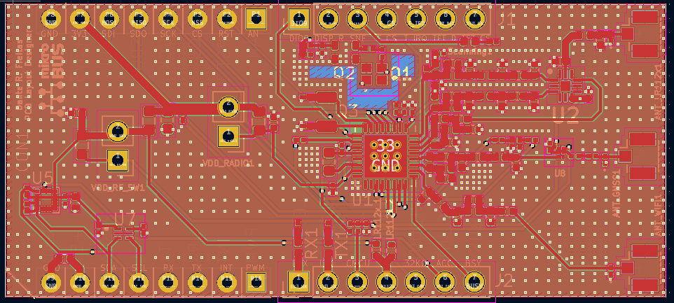
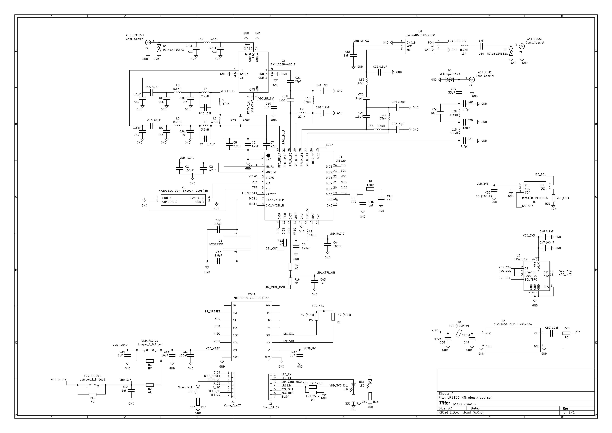

# Semtech LR1120 Mikrobus Board

''The [LR1120](https://fr.semtech.com/products/wireless-rf/lora-edge/lr1120) is an ultra-low power device targeting global geolocation applications. It provides multi band LoRa® and Long Range - Frequency Hopping Spread Spectrum (LR-FHSS) communication over sub-GHz and 2.4GHz Industrial, Scientific and Medical (ISM) bands as well as licensed S-Band for satellites. It integrates a Cloud-native multi-constellation global navigation satellite system (GNSS) scanner and a passive Wi-Fi MAC address scanner, both leveraging [Semtech’s LoRa Cloud™ services](https://www.loracloud.com/documentation/modem_services?url=gls.html#apigeoloclr1110).''

The objective of this student homework is to adapt the [Semtech LR1120 `LR1120MB1DIS` eval board (868 MHz for the SubGhz interface)](https://fr.semtech.com/products/wireless-rf/lora-edge/lr1120dvk1tcks) to the convenient [Mikrobus form factor](https://download.mikroe.com/documents/standards/mikrobus/mikrobus-standard-specification-v200.pdf).

This project is being developed at [Polytech Grenoble](https://www.polytech-grenoble.fr/) and [CSUG](https://www.csug.fr/) ([Université Grenoble-Alpes](https://www.univ-grenoble-alpes.fr/)) by Dante Regiani Freitas and supervised by Prof. Didier Donsez.

## Hardware
* [Schematic](images/schematic.pdf)
* [Kicad design](./kicad)

## Firmware
* [Tutorial on LR11120](https://github.com/CampusIoT/tutorial/tree/master/lr1120)

## Misc
* [TinyGS 2.4 GHz Ground Station](https://github.com/thingsat/tinygs_2g4station)

## Media

